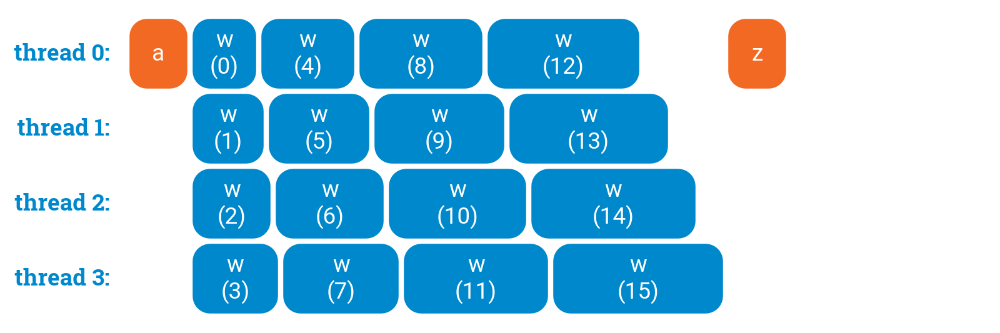
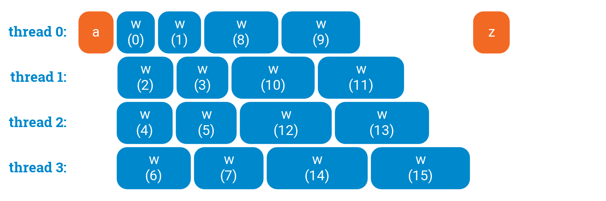
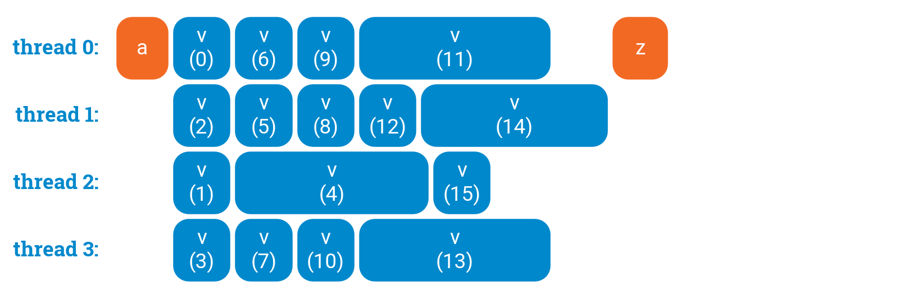
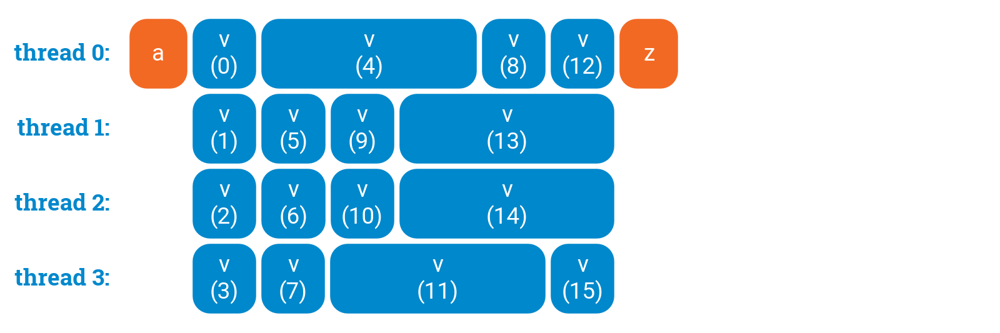

# Laboratorul 2 - Paralelizarea buclelor în OpenMP
## Loop scheduling
În OpenMP, când o structură de tip for este paralelizată fiecărui thread îi revine un număr egal de iterații din cadrul acelui for. Uneori, se întâmplă ca iterațiile să fie echilibrate între ele în ceea ce privește workload-ul, alteori nu. Când workload-ul nu este echilibrat între thread-uri, pot apărea probleme în ceea ce privește performanțele programului.

Pentru a preveni situații când thread-urile au volume diferite de workload, există conceptul de scheduling în OpenMP. Pentru scheduling se folosește directiva `schedule(tip_de_schedule, chunk_size)`, unde se precizează tipul de schedule (static, dynamic, guided, auto) și dimensiunea unui chunk (acest lucru este opțional, în cazul în care nu se specifică acesta are o valoare default).

Tipar de scheduling:
```c
#pragma omp parallel for schedule(tip_de_schedule, chunk_size)
for (int i = 0; i < 100; i++) {
    // do stuff
}
```
## Static scheduling
În cadrul static scheduling, iterațiile unui for împărțite în chunks, de dimensiune `chunk_size`, și distribuite thread-urilor în ordine circulară. Dacă `chunk_size` nu este precizat, acesta va fi egal cu `numărul_de_iterații_for / numărul_de_thread-uri`

Exemple - folosim 4 thread-uri:

1) `chunk_size` = 2
```c
#pragma omp parallel for private(i) schedule(static, 2)
for (i = 0; i < 16; i++) {
    printf("iteration no. %d | thread no. %d\n", i, omp_get_thread_num());
}
```
În acest caz, distribuția iterațiilor pe thread-uri va fi în felul următor:
- thread-ul 0: 0, 1 (chunk 1), 8, 9 (chunk 5)
- thread-ul 1: 2, 3 (chunk 2), 10, 11 (chunk 6)
- thread-ul 2: 4, 5 (chunk 3), 12, 13 (chunk 7)
- thread-ul 3: 6, 7 (chunk 4), 14, 15 (chunk 8)

2) `chunk_size` = 4 (dacă nu l-am preciza, default ar fi 4 în acest caz - 16 iterații și 4 threads, deci 16 / 4)
```c
#pragma omp parallel for private(i) schedule(static, 4)
for (i = 0; i < 16; i++) {
    printf("iteration no. %d | thread no. %d\n", i, omp_get_thread_num());
}
```
În acest caz, distribuția iterațiilor pe thread-uri va fi în felul următor:
- thread-ul 0: 0, 1, 2, 3 (chunk 1)
- thread-ul 1: 4, 5, 6, 7 (chunk 2)
- thread-ul 2: 8, 9, 10, 11 (chunk 3)
- thread-ul 3: 12, 13, 14, 15 (chunk 4)

Static schedule este util de folosit atunci când se știe că există echilibru între iterațiile din chunks pentru un anumit `chunk_size`.

### Cum poate influența valoarea `chunk_size` performanțele

Să luam următorul exemplu de cod (rulând cu 4 threads), unde `w(int i)` este o funcție a cărei complexitate este influențată de parametrul de intrare i:
```c
a();
#pragma omp parallel for
for (int i = 0; i < 16; ++i) {
    w(i);
}
z();
```

Grafic, fără niciun tip de scheduling, performanța este ilustrată în felul următor:


Aici se poate observa un dezechilibru în ceea ce privește workload-ul între thread-uri, thread-ul 3 având un workload dublu față de thread-ul 0.

Dacă setăm `chunk_size` cu 1, performanța este ilustrată în felul următor:


În acest caz, thread-urile au un workload echilibrat, datorită distribuirii uniforme a iterațiilor din for, așadar avem o performanță bună.

Dacă setăm `chunk_size` cu 2, performanța este ilustrată în felul următor:


În acest caz, se observă un dezechilibru între thread-uri din punctul de vedere al workload-ului, implicând o performanță mai proastă decât în cazul când `chunk_size` este setat cu 1.
## Dynamic scheduling
În cadrul dynamic scheduling, iterațiile sunt împărțite în chunks de dimensiune chunk_size, ca la static scheduling, însă diferența față de static scheduling este că iterațiile nu sunt distribuite într-o anumită ordine către thread-uri, așa cum se întâmplă la static schedule. Dacă nu se precizează valoarea pentru `chunk_size`, atunci va avea valoarea default de 1.

Dynamic schedule este folosit atunci când avem iterații total debalansate în ceea ce privește workload-ul (în timp ce la static schedule putem intui un pattern de workload între iterații - acest lucru puteți observa în demo, în fișierul `static_schedule.c`).

Exemplu:
```c
#pragma omp parallel for private(i) schedule(dynamic, 2)
for (i = 0; i < 16; i++) {
    w(i);
    printf("iteration no. %d | thread no. %d\n", i, omp_get_thread_num());
}
```
unde `w(i)` este o funcție ce are performanță aleatoare, care poate să nu depindă de parametrul de intrare.

Spre deosebire de static scheduling, la dynamic scheduling există comunicare între threads după fiecare iterație, cu scopul de a construi o împărțire a iterațiilor între thread-uri, pentru a avea workload-urile între thread-uri cât mai balansate, fapt ce duce la overhead.

După fiecare rulare, împărțirea iterațiilor către thread-uri se schimbă.

Un exemplu grafic ar fi următorul:
- aici nu folosim niciun tip de schedule:

- aici folosim dynamic schedule și se poate observa că nu există distribuție uniformă a iterațiilor către thread-uri:


De reținut faptul că dynamic schedule poate să nu fie mereu optim și este posibil ca static schedule să fie o soluție mai bună, cum ar fi în acest exemplu (static cu `chunk_size = 1`):

## Guided scheduling
TODO
## Auto scheduling
La auto scheduling, tipul de scheduling (static, dynamic, guided) este determinat la compilare și/sau la runtime.

Exemplu:
```c
#pragma omp parallel for private(i) schedule(auto)
for (i = 0; i < 16; i++) {
    w(i);
    printf("iteration no. %d | thread no. %d\n", i, omp_get_thread_num());
}
```
## nowait
TODO

Exemplu:
```c
#pragma omp parallel
{
    #pragma omp for nowait private(i)
    for (i = 0; i < 16; i++) {
        c(i);
    }
    d();
}
```
## Reduction - recapitulare
`reduction` este o directivă folosită pentru operații de tip reduce / fold pe arrays / colecții sau simple însumări / înmulțiri în cadrul unui loop. Mai precis, elementele dintr-un array sau indecșii unui loop sunt "acumulați" într-o singură variabilă, cu ajutorul unei operații, al cărui semn este precizat.

Tipar: `reduction(operator_operatie:variabila_in_care_se_acumuleaza)`

Exemplu de reduction: `reduction(+:sum)`, unde se însumează elementele unui array în variabila `sum`

Exemplu de folosire de reduction:
```c
int sum = 0;

#pragma omp parallel for reduction(+:sum) private(i)
for (i = 1; i <= num_steps; i++) {
    sum += i;
}
```
## Exerciții
TODO
## Resurse