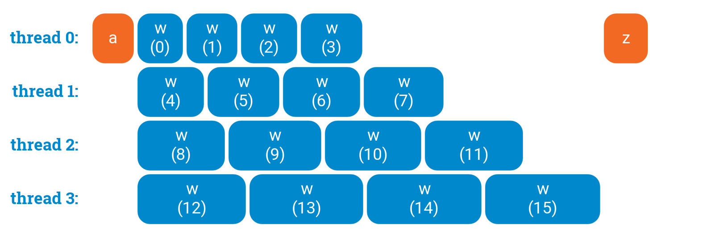

# Laboratorul 2 - Paralelizarea buclelor în OpenMP
## Loop scheduling
În OpenMP, când o structură de tip for este paralelizată fiecărui thread îi revine un număr egal de iterații din cadrul acelui for. Uneori, se întâmplă ca iterațiile să fie echilibrate între ele în ceea ce privește workload-ul, alteori nu. Când workload-ul nu este echilibrat între thread-uri, pot apărea probleme în ceea ce privește performanțele programului.

Pentru a preveni situații când thread-urile au volume diferite de workload, există conceptul de scheduling în OpenMP. Pentru scheduling se folosește directiva `schedule(tip_de_schedule, chunk_size)`, unde se precizează tipul de schedule (static, dynamic, guided, auto) și dimensiunea unui chunk (acest lucru este opțional, în cazul în care nu se specifică acesta are o valoare default).

Tipar de scheduling:
```c
#pragma omp parallel for schedule(tip_de_schedule, chunk_size)
for (int i = 0; i < 100; i++) {
    // do stuff
}
```
## Static scheduling
În cadrul static scheduling, iterațiile unui for împărțite în chunks, de dimensiune `chunk_size`, și distribuite thread-urilor în ordine circulară. Dacă `chunk_size` nu este precizat, acesta va fi egal cu `numărul_de_iterații_for / numărul_de_thread-uri`

Exemple - folosim 4 thread-uri:

1) `chunk_size` = 2
```c
#pragma omp parallel for private(i) schedule(static, 2)
for (i = 0; i < 16; i++) {
    printf("iteration no. %d | thread no. %d\n", i, omp_get_thread_num());
}
```
În acest caz, distribuția iterațiilor pe thread-uri va fi în felul următor:
- thread-ul 0: 0, 1 (chunk 1), 8, 9 (chunk 5)
- thread-ul 1: 2, 3 (chunk 2), 10, 11 (chunk 6)
- thread-ul 2: 4, 5 (chunk 3), 12, 13 (chunk 7)
- thread-ul 3: 6, 7 (chunk 4), 14, 15 (chunk 8)

2) `chunk_size` = 4 (dacă nu l-am preciza, default ar fi 4 în acest caz - 16 iterații și 4 threads, deci 16 / 4)
```c
#pragma omp parallel for private(i) schedule(static, 4)
for (i = 0; i < 16; i++) {
    printf("iteration no. %d | thread no. %d\n", i, omp_get_thread_num());
}
```
În acest caz, distribuția iterațiilor pe thread-uri va fi în felul următor:
- thread-ul 0: 0, 1, 2, 3 (chunk 1)
- thread-ul 1: 4, 5, 6, 7 (chunk 2)
- thread-ul 2: 8, 9, 10, 11 (chunk 3)
- thread-ul 3: 12, 13, 14, 15 (chunk 4)

Static schedule este util de folosit atunci când se știe că există echilibru între iterațiile din chunks pentru un anumit `chunk_size`.

### Cum poate influența valoarea `chunk_size` performanțele

Să luam următorul exemplu de cod, unde `w(int i)` este o funcție a cărei complexitate este influențată de parametrul de intrare i:
```c
a();
#pragma omp parallel for
for (int i = 0; i < 16; ++i) {
    w(i);
}
z();
```

Grafic, fără niciun tip de scheduling, performanța ar fi ilustrată în felul următor:


Aici se poate observa un dezechilibru în ceea ce privește workload-ul între thread-uri, thread-ul 3 având un workload dublu față de thread-ul 0.
## Dynamic scheduling
## Guided scheduling
## Auto scheduling
## nowait
## Exerciții
## Resurse