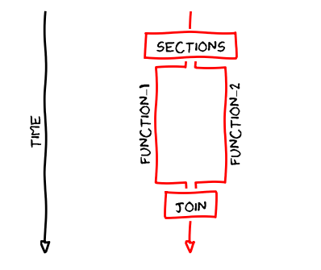

# Laboratorul 3 - Advanced OpenMP
## Sections
Uneori dorim să distribuim ca thread-uri diferite să execute task-uri diferite în același timp. În această privință ne vine de ajutor conceptul de sections, prin care două sau mai multe thread-uri execută două sau mai multe sections corespunzătoare acestora (adică thread-urilor, fiecare thread cu un section).

În OpenMP se folosește directiva `sections` pentru a marca o zonă din cod în care distribuim task-urile diferite (sections) thread-urilor (fiecare thread cu câte un section). Sintaxa în OpenMP este următoarea:
```c
#pragma omp parallel 
{
    // se marchează blocul de sections
    #pragma omp sections
    {
        #pragma omp section
        {
            // section executat de thread-ul X
        }
        
        #pragma omp section
        {
            // section executat de thread-ul Y
        }

        #pragma omp section
        {
            // section executat de thread-ul Z
        }           
    }

    #pragma omp sections
    {
        #pragma omp section
        {
            // section executat de thread-ul X
        }
        
        #pragma omp section
        {
            // section executat de thread-ul Y
        }
    }
}

#pragma omp parallel sections
{
    #pragma omp section
    {
        // section executat de thread-ul X
    }
        
    #pragma omp section
    {
        // section executat de thread-ul Y
    }
}
```


## Single
Dacă dorim ca o secvență de cod (dintr-o bucată de cod paralelizat) să fie executat doar de un singur thread, folosim directiva SINGLE. Aceasta este folosită, de regulă, în operații I/O.

Exemplu:
```c
#pragma omp parallel
{
    #pragma omp single
    {
        // cod executat de un singur thread
    }
}
```
### Master
Directiva MASTER este o particularizare a directivei SINGLE, unde codul din zona paralelizată este executat de thread-ul master (cel cu id-ul 0).

```c
#pragma omp parallel
{
    #pragma omp master
    {
        // cod executat de un singur thread
    }
}
```

## Construcții de sincronizare
### Mutex
Pentru zonele critice, unde avem operații de read-write, folosim directiva `#pragma omp critical`, care reprezintă un mutex, echivalentul lui `pthread_mutex_t` din pthreads, care asigură faptul că un singur thread accesează zona critică la un moment dat, thread-ul deținând lock-ul pe zona critică în momentul respectiv, și că celelalte thread-uri care nu au intrat încă în zona critică așteaptă eliberarea lock-ului de către thread-ul aflat în zona critică în acel moment.

Exemplu de folosire:
```c
#include <stdio.h>
#include <omp.h>

int main (int argc, char** argv) {
    int thread_id, sum = 0;
    #pragma omp parallel private(thread_id) shared(sum)
    {
        thread_id = omp_get_thread_num();
        #pragma omp critical
        sum += thread_id;
    }
    printf("%d",sum);
    
    return 0;
}
```

### Barieră
Un alt element de sincronizare reprezintă bariera, care asigură faptul că niciun thread gestionat de barieră nu trece mai departe de aceasta decât atunci cand toate thread-urile gestionate de barieră au ajuns la punctul unde se află bariera.

În OpenMP, pentru barieră avem directiva `#pragma omp barrier`, echivalent cu `pthread_barrier_t` din pthreads.

Exemplu de folosire:
```c
#include <stdio.h>
#include <omp.h>

int main (int argc, char** argv) {
    #pragma omp parallel 
    {
        printf("First print by %d\n", omp_get_thread_num());
        #pragma omp barrier
        printf("Second print by %d\n", omp_get_thread_num());
    }
    
    return 0;
}
```

### Reduction
`reduction` este o directivă folosită pentru operații de tip reduce / fold pe arrays / colecții sau simple însumări / înmulțiri în cadrul unui loop. Mai precis, elementele dintr-un array sau indecșii unui loop sunt "acumulați" într-o singură variabilă, cu ajutorul unei operații, al cărui semn este precizat.

Tipar: `reduction(operator_operatie:variabila_in_care_se_acumuleaza)`

Exemplu de reduction: `reduction(+:sum)`, unde se însumează elementele unui array în variabila `sum`

Exemplu de folosire de reduction:
```c
int sum = 0;

#pragma omp parallel for reduction(+:sum) private(i)
for (i = 1; i <= num_steps; i++) {
    sum += i;
}
```
### Atomic
Directiva ATOMIC permite executarea unor instrucțiuni în mod atomic, instrucțiuni care provoacă race conditions între thread-uri, problemă pe care această directivă o rezolvă.

Exemplu de folosire:
```c
#include <stdio.h>
#include <omp.h>

int main (int argc, char** argv) {
    int thread_id, sum = 0;
    #pragma omp parallel private(thread_id) shared(sum)
    {
        thread_id = omp_get_thread_num();
        #pragma omp atomic
        sum += thread_id;
    }
    printf("%d",sum);
    
    return 0;
}
```
### Ordered
Directiva ORDERED este folosit în for-uri cu scopul de a distribui în ordine iterațiile către thread-uri.

Exemplu:
```c
#pragma omp parallel for ordered private(i)
for (i = 0; i < 10; i++) {
    printf("** iteration %d thread no. %d\n", i, omp_get_thread_num());
}
```    
Afișare:
```bash
** iteration 9 thread no. 7
** iteration 5 thread no. 3
** iteration 6 thread no. 4
** iteration 7 thread no. 5
** iteration 4 thread no. 2
** iteration 2 thread no. 1
** iteration 3 thread no. 1
** iteration 0 thread no. 0
** iteration 1 thread no. 0
** iteration 8 thread no. 6
```
## Clauze legate de vizibilitatea variabilelor
- `SHARED`
- `PRIVATE` - variabilă cu valoarea vizibilă doar în blocul paralel (diferă de THREADPRIVATE)
- `DEFAULT`
- `REDUCTION`
- `NONE`
- `THREADPRIVATE` - fiecare thread are propriile sale copii ale unor variabile
- `FIRSTPRIVATE` - folosit pentru ca variabilele `THREADPRIVATE` să aibă valorile, inițial, din exterior (dinainte)
- `LASTPRIVATE` - invers FIRSTPRIVATE, ultima valoare asignată unei variabile `THREADPRIVATE` e vizibilă după blocul paralelizat
- `COPYPRIVATE` - folosit în blocurile `SINGLE`, pentru a face vizibilă valoarea atribuită unei variabile într-un bloc `SINGLE` pentru toate thread-urile
- `COPYIN` - asignarea unei variabile `THREADPRIVATE` este vizibilă tuturor thread-urilor

## Tasks (opțional)
Task-urile în OpenMP reprezintă un concept prin care putem să avem thread pools pentru paralelizarea de soluții ale căror dimensiune nu o știm (echivalent cu `ExecutorService` din Java). Un task este executat la un moment dat de către un thread din thread pool.

Pentru crearea unui task se folosește directiva `TASK`:
```c
#pragma omp task [clause1 [[,] clause2, ...]]
```

Pentru sincronizarea task-urilor (în sensul să așteptăm toate rezultatele task-urilor, în stilul barierei), se folosește directiva `TASKWAIT` (exemplu de folosire în exemplul Fibonacci de mai jos).

În privința variabilelor dintr-un task, aici avem trei variante de variabile:
- `shared` - toate task-urile au acces la aceeași adresă a unei variabile, o modificare asupra variabilei din partea unui task va fi vizibilă către toate task-urile (uneori putem avea potențial de erori în acest caz).
- `firstprivate` - fiecare task va avea o copie a unei variabile inițializate cu o valoare înainte de crearea task-ului respectiv.
- `private` - aici putem să avem variabile care nu sunt inițializate înainte de crearea task-ului și care să fie inițializate în cadrul task-ului.

```c
void f () {
    double x1 = 1.0;
    double x2 = 2.0;
    #pragma omp parallel firstprivate(x2)
    {
        double x3 = 3.0; // private to each implicit task due to scope
        #pragma omp task
        {
            double x4 = 4.0; // private due to scope
            // x1 : shared ( shared by all implicit tasks )
            // x2 : firstprivate ( due to “firstprivate(x2)” )
            // x3 : firstprivate ( not shared by all implicit tasks )
        }
    }
}
```

Pentru paralelizarea unor probleme recursive (Fibonacci, parcurgeri, etc.), task-urile reprezintă o soluție optimă în acest caz. De asemenea, putem crea task-uri în cadrul unui task părinte.

Exemplu:
```c
#include <stdio.h>
#include <omp.h>

int fib(int n) {
    int i, j;
    printf("n = %d | Thread id = %d\n", n, omp_get_thread_num());
 
    if (n < 2) {
        return n;
    }
 
    #pragma omp task shared(i)
    i = fib(n - 1);
    
    #pragma omp task shared(j)
    j = fib(n - 2);
    
    // se așteaptă să se termine task-urile de mai sus
    #pragma omp taskwait
    return i + j;
}


int main() {
    int n = 10;
    omp_set_num_threads(4);
    
    #pragma omp parallel shared(n)
    {
        #pragma omp single
        printf ("fib(%d) = %d\n", n, fib(n));
    }
}
```

Se pot observa asemănări între tasks și sections în ceea ce privește modul de folosire (se pot folosi sections în cadrul problemelor recursive), însă diferențele dintre aceastea sunt următoarele:
- la sections instrucțiunile sunt executate imediat când thread-ul asociat acelui section ajunge în section-ul respectiv, când la tasks instrucțiunile pot fi executate după ce thread-ul asociat task-ului trece de task-ul respectiv
- la sections putem avea overhead și load balancing slab

## Exerciții
1)  **(10 puncte)** Paralelizați fișierul main.c din schelet, unde se citește un fișier, unde pe prima linie se află numărul de elemente pentru un array și pe următoarea linie se află array-ul respectiv, se face suma numerelor (aici faceți în trei moduri, separat, cu reduction, cu atomic și cu critical, unde veți măsura timpii de execuție - hint, folosiți directiva master ca un singur thread să facă măsurătorile), iar la final, cu ajutorul sections, scrieți timpii de execuție în trei fișiere (este deja implementată funcția de scriere în fișier).

Hint: o să aveți nevoie de barieră la citire și înainte de scrierea în fișiere. 

De probă, încercați să puneți `ORDERED` la for-urile paralelizate, pentru a vedea cum este afectată performanța.

2) **(opțional)** Paralelizați folosind task-uri codul din `tree.c` (folosiți task-uri în funcțiile `preorder` și `height` - la ultima trebuie să folosiți `taskwait`).
## Resurse
- [Cursuri de OpenMP, MPI, CUDA - COSC462](https://icl.cs.utk.edu/classes/cosc462/2017/)