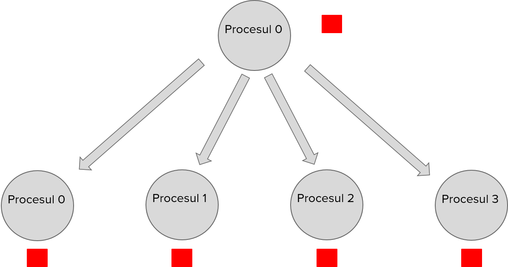
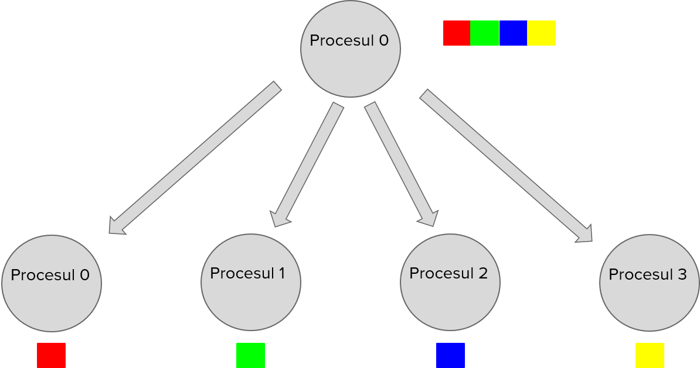
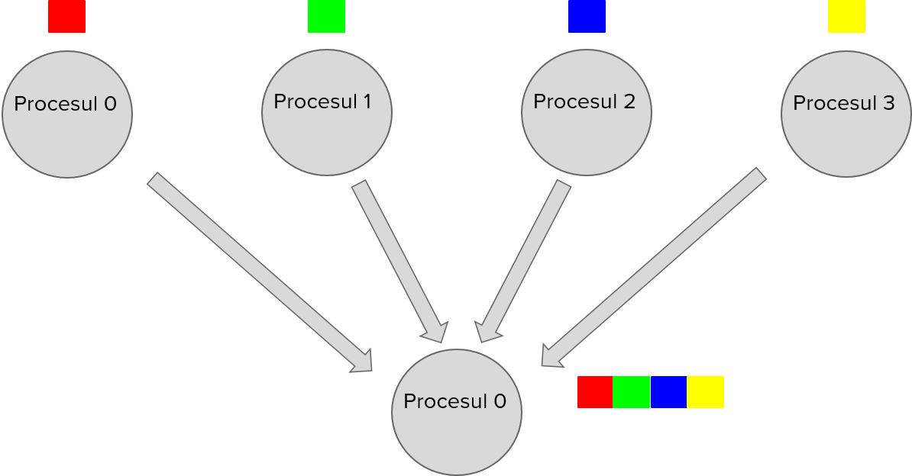

# Laboratorul 4 - MPI
## Despre MPI
MPI (Message Passing Interface) reprezintă un standard pentru comunicarea prin mesaje în cadrul programării distribuite, elaborat de MPI Forum, și are la bază modelul proceselor comunicante prin mesaje.

Un proces reprezintă un program aflat în execuție și se poate defini ca o unitate de bază care poate executa una sau mai multe sarcini în cadrul unui sistem de operare. Spre deosebire de thread-uri, un proces are propriul său spațiu de adrese (propria zonă de memorie) și acesta poate avea, în cadrul său, mai multe thread-uri în execuție, care partajează resursele procesului.
## Compilare și rulare
În cadrul lucrului în C/C++, MPI reprezintă o bibliotecă, care are funcționalitățile implementate într-un header numit `mpi.h`. Pentru compilare, la MPI există un compilator specific:
- `mpicc`, pentru lucrul în C
- `mpic++`, pentru lucrul în C++

În ambele limbaje, pentru rularea unui program MPI folosim comanda `mpirun`, împreună cu parametrul `-np`, unde precizăm numărul de procese care rulează în cadrul programului distribuit.

Exemplu:
- compilare:
    - C: `mpicc hello.c -o hello`
    - C++: `mpic++ hello.cpp -o hello`
- rulare: `mpirun -np 4 hello` - rulare cu 4 procese

Dacă încercați să rulați comanda mpirun cu un număr de procese mai mare decât numărul de core-uri fizice disponibile pe procesorul vostru, este posibil să primiți o eroare cum ca nu aveți destule sloturi libere. Puteți elimina acea eroare adăugând parametrul `--oversubscribe` atunci când rulați mpirun.

### Instalare MPI
Pentru a lucra cu MPI, trebuie să instalați biblioteca pentru MPI pe Linux, folosind următoarea comandă: `sudo apt install openmpi-bin openmpi-common openmpi-doc libopenmpi-dev`
## Implementarea unui program distribuit în MPI
Exemplu de program MPI - Hello World:
```c
#include "mpi.h"
#include <stdio.h>
#include <stdlib.h>
 
#define  MASTER 0
 
int main (int argc, char *argv[]) {
    int numtasks, rank, len;
    char hostname[MPI_MAX_PROCESSOR_NAME];
 
    MPI_Init(&argc, &argv);
    MPI_Comm_size(MPI_COMM_WORLD, &numtasks);
    MPI_Comm_rank(MPI_COMM_WORLD,&rank);
    MPI_Get_processor_name(hostname, &len);
    if (rank == MASTER)
        printf("MASTER: Number of MPI tasks is: %d\n",numtasks);
    else
        printf("WORKER: Rank: %d\n",rank);
 
    MPI_Finalize();
}
```

Un comunicator (`MPI_Comm`) reprezintă un grup de procese care comunică între ele. `MPI_COMM_WORLD` reprezintă comunicatorul default, din care fac parte toate procesele.

Funcții:

- `MPI_Init` - se inițializează programul MPI, mai precis se creează contextul în cadrul căruia rulează procesele. Argumentele din linie de comandă sunt pasate către contextul de rulare a proceselor.
- `MPI_Comm_size` - funcție care determină numărul de procese (numtasks) care rulează în cadrul comunicatorului (de regulă `MPI_COMM_WORLD`)
- `MPI_Comm_rank` - funcție care determină identificatorul (rangul) procesului curent în cadrul comunicatorului.
- `MPI_Get_processor_name` - determină numele procesorului
- `MPI_Finalize` - declanșează terminarea programului MPI

În cadrul schimbului de date între procese, este necesar mereu să precizăm tipul acestora. În MPI, se folosește enum-ul `MPI_Datatype`, care se mapează cu tipurile de date din C/C++, după cum puteți vedea în tabelul de mai jos:
| `MPI_Datatype`| Echivalentul din C/C++ |
| ------------- | -----------            |
| `MPI_INT`      | `int`                  |
| `MPI_LONG`      | `long`                 |
| `MPI_CHAR`      | `char`                 |
| `MPI_FLOAT`     | `float`                |
| `MPI_DOUBLE`    | `double`               |
## Funcții de transmitere a datelor
### MPI_Send
`MPI_Send` reprezintă funcția prin care un proces trimite date către un alt proces. Semnătura funcției este următoarea:
```c
int MPI_Send(void* data, int count, MPI_Datatype datatype, int destination, int tag, MPI_Comm communicator)
```
, unde:
- `data (↓)` - reprezintă datele trimise de la procesul sursă către procesul destinație
- `count (↓)` - dimensiunea datelor transmise
- `datatype (↓)` - tipul datelor transmise
- `destination (↓)` - rangul / identificatorului procesului destinație, către care se trimit datele
- `tag (↓)` - identificator al mesajului
- `communicator (↓)` - comunicatorul în cadrul căruia se face trimiterea datelor între cele două procese
MPI_Send este o funcție blocantă. Mai precis, programul se blochează până când bufferul dat ca prim parametru poate fi refolosit, chiar dacă nu se execută acțiunea de primire a mesajului transmis de procesul curent (`MPI_Recv`)

Dacă apare cazul în care procesul P1 trimite date (`MPI_Send`) la procesul P2, iar P2 nu are suficient loc în buffer-ul de recepție (buffer-ul nu are suficient loc liber sau este plin) atunci P1 se va bloca.
### MPI_Recv
`MPI_Recv` reprezintă funcția prin care un proces primește date de la un alt proces. Semnătura funcției este următoarea:
```c
int MPI_Recv(void* data, int count, MPI_Datatype datatype, int source, int tag, MPI_Comm communicator, MPI_Status* status), unde:
```
, unde:
- `data (↑)` - reprezintă datele primite de la procesul sursă de către procesul destinație
- `count (↓)` - dimensiunea datelor primite
- `datatype (↓)` - tipul datelor primite
- `source (↓)` - rangul / identificatorului procesului sursă, care trimite datele
- `tag (↓)` - identificator al mesajului
- `communicator (↓)` - comunicatorul în cadrul căruia se face trimiterea datelor între cele două procese
- `status` - conține date despre mesajul primit, `MPI_Status` fiind o structură ce conține informații despre mesajul primit (sursa, tag-ul mesajului, dimensiunea mesajului). Dacă nu dorim să ne folosim de datele despre mesajul primit, punem `MPI_STATUS_IGNORE`, prin care se ignoră status-ul mesajului.

În situația în care procesul P apelează funcția de `MPI_Recv()`, el se va bloca până va primi toate datele asteptate, astfel că dacă nu va primi nimic sau ceea ce primește este insuficient, P va rămâne blocat. Adică `MPI_Recv()` se termină doar în momentul în care buffer-ul a fost umplut cu datele așteptate.

Structura `MPI_Status` include următoarele câmpuri:

- `int count` - dimensiunea datelor primite
- `int MPI_SOURCE` - identificatorul procesului sursă, care a trimis datele
- `int MPI_TAG` - tag-ul mesajului primit
MPI_Recv este o funcție blocantă, mai precis programul se poate bloca până când se execută acțiunea de trimitere a mesajului către procesul sursă.

Un exemplu de program în care un proces trimite un mesaj către un alt proces:
```c
#include "mpi.h"
#include <stdio.h>
#include <stdlib.h>
 
int main (int argc, char *argv[])
{
    int  numtasks, rank, len;
    char hostname[MPI_MAX_PROCESSOR_NAME];
 
    MPI_Init(&argc, &argv);
    MPI_Comm_size(MPI_COMM_WORLD, &numtasks); // Total number of processes.
    MPI_Comm_rank(MPI_COMM_WORLD,&rank); // The current process ID / Rank.
    MPI_Get_processor_name(hostname, &len);
 
    srand(42);
    int random_num = rand();
    printf("Before send: process with rank %d has the number %d.\n", rank,
            random_num);
 
    if (rank == 0) {
        MPI_Send(&random_num, 1, MPI_INT, 1, 0, MPI_COMM_WORLD);
    } else {
        MPI_Status status;
        MPI_Recv(&random_num, 1, MPI_INT, 0, 0, MPI_COMM_WORLD, &status);
        printf("Process with rank %d, received %d with tag %d.\n",
                rank, random_num, status.MPI_TAG);
    }
 
    printf("After send: process with rank %d has the number %d.\n", rank,
            random_num);
 
    MPI_Finalize();
 
}
```

Când un proces X trimite un mesaj către un proces Y, tag-ul T al mesajului din `MPI_Send`, executat de procesul X, trebuie să fie același cu tag-ul mesajului din `MPI_Recv`, executat de procesul Y, deoarece procesul Y așteaptă un mesaj care are tag-ul T, altfel, dacă sunt tag-uri diferite, programul se va bloca.

O ilustrație a modului cum funcționează împreună funcțiile MPI_Send și MPI_Recv:


Mai jos aveți un exemplu în care un proces trimite un întreg array de 100 de elemente către un alt proces:
```c
#include "mpi.h"
#include <stdio.h>
#include <stdlib.h>
 
int main (int argc, char *argv[])
{
    int numtasks, rank, len;
    int size = 100;
    char hostname[MPI_MAX_PROCESSOR_NAME];
    int arr[size];
 
    MPI_Init(&argc, &argv);
    MPI_Comm_size(MPI_COMM_WORLD, &numtasks);
    MPI_Comm_rank(MPI_COMM_WORLD,&rank);
    MPI_Get_processor_name(hostname, &len);
 
    srand(42);
    if (rank == 0) {
        for (int i = 0; i < size; i++) {
            arr[i] = i;
        }
 
        printf("Process with rank [%d] has the following array:\n", rank);
        for (int i = 0; i < size; i++) {
            printf("%d ", arr[i]);
        }
        printf("\n");
 
        MPI_Send(&arr, size, MPI_INT, 1, 1, MPI_COMM_WORLD);
        printf("Process with rank [%d] sent the array.\n", rank);
    } else {
        MPI_Status status;
        MPI_Recv(&arr, size, MPI_INT, 0, 1, MPI_COMM_WORLD, &status);
        printf("Process with rank [%d], received array with tag %d.\n",
                rank, status.MPI_TAG);
 
        printf("Process with rank [%d] has the following array:\n", rank);
        for (int i = 0; i < size; i++) {
            printf("%d ", arr[i]);
        }
        printf("\n");
    }
 
    MPI_Finalize();
 
}
```

### MPI_Bcast
`MPI_Bcast` reprezintă o funcție prin care un proces trimite un mesaj către toate procesele din comunicator (message broadcast), inclusiv lui însuși.

În cadrul implementării `MPI_Bcast` sunt executate acțiunile de trimitere și de recepționare de mesaje, așadar nu trebuie să apelați `MPI_Recv`.

Semnătura funcției este următoarea:
```c
int MPI_Bcast(void* data, int count, MPI_Datatype datatype, int root, MPI_Comm communicator)
```
, unde:
- `data (↓ + ↑)` - reprezintă datele care sunt transmise către toate procesele. Acest parametru este de tip input pentru procesul cu identificatorul root și este de tip output pentru restul proceselor.
- `count (↓)` - dimensiunea datelor trimise
- `datatype (↓)`- tipul datelor trimise
- `root (↓)` - rangul / identificatorului procesului sursă, care trimite datele către toate procesele din comunicator, inclusiv lui însuși
- `tag (↓)` - identificator al mesajului
- `communicator (↓)` - comunicatorul în cadrul căruia se face trimiterea datelor către toate procesele din cadrul acestuia

O ilustrație care arată cum funcționează `MPI_Bcast` aveți mai jos:



### MPI_Scatter
`MPI_Scatter` este o funcție prin care un proces împarte un array pe bucăți egale ca dimensiuni, unde fiecare bucată revine, în ordine, fiecărui proces, și le trimite tuturor proceselor din comunicator, inclusiv lui însuși.

Semnătura funcției este următoarea:
```c
int MPI_Scatter(void* send_data, int send_count, MPI_Datatype send_datatype, void* recv_data, int recv_count, MPI_Datatype recv_datatype, int root, MPI_Comm communicator)
```
, unde:
- send_data (↓) - reprezintă datele care sunt împărțite și trimise către procesele din comunicator
- send_count (↓) - reprezintă dimensiunea bucății care revine fiecărui proces (de regulă se pune ca fiind dimensiunea_totală / număr_de_procese).
- send_datatype (↓) - tipul datelor trimise către procese
- recv_data (↑) - reprezintă datele care sunt primite și stocate de către procese
- recv_count (↓) - dimensiunea datelor primite (de regulă dimensiunea_totală / număr_de_procese)
- recv_datatype (↓) - tipul datelor primite de către procese (de regulă este același cu send_datatype)
- root (↓) - identificatorul procesului care împarte datele și care le trimite către procesele din comunicator, inclusiv lui însuși
- communicator (↓) - comunicatorul din care fac parte procesele (de regulă `MPI_COMM_WORLD`)

O ilustrație a modului cum funcționează `MPI_Scatter`:



### MPI_Gather
`MPI_Gather` este o funcție care reprezintă inversul lui `MPI_Scatter`, în sensul că un proces primește elemente de la fiecare proces din comunicator, inclusiv de la el însuși, și le unifică într-o singură colecție.

Semnătura funcției este următoarea:
```c
int MPI_Gather(void* send_data, int send_count, MPI_Datatype send_datatype, void* recv_data, int recv_count, MPI_Datatype recv_datatype, int root, MPI_Comm communicator)
```
, unde:

- send_data (↓) - reprezintă datele care trimise de fiecare proces către procesul cu id-ul root
- send_count (↓) - reprezintă dimensiunea bucății trimisă de fiecare proces (de regulă se pune ca fiind dimensiunea_totală / număr_de_procese).
- send_datatype (↓) - tipul datelor trimise de către procese
- recv_data (↑) - reprezintă datele care sunt primite și stocate de către procesul root
- recv_count (↓) - dimensiunea datelor primite (de regulă dimensiunea_totală / număr_de_procese)
- recv_datatype (↓) - tipul datelor primite de către procesul root (de regulă este același cu send_datatype)
- root (↓) - identificatorul procesului care primește datele (inclusiv de la el însuși)
- communicator (↓) - comunicatorul din care fac parte procesele (de regulă `MPI_COMM_WORLD`)

O ilustrare a modului cum funcționează `MPI_Gather`:



Mai jos aveți un exemplu de MPI_Scatter folosit împreună cu MPI_Gather:
```c
#include <stdio.h>
#include <stdlib.h>
#include <mpi.h>
 
#define ROOT 0
#define CHUNK_SIZE 5 // numarul de elemente per proces
 
int main (int argc, char **argv) {
    int rank, proc, a;
 
    int* arr;
    int* process_arr;
    int* result_arr;
 
    MPI_Init(&argc, &argv);
 
    MPI_Comm_rank(MPI_COMM_WORLD, &rank);
    MPI_Comm_size(MPI_COMM_WORLD, &proc);
 
    if (rank == ROOT) {
        arr = malloc (CHUNK_SIZE * proc * sizeof(int));
        for (int i = 0; i < proc * CHUNK_SIZE; ++i) {
            arr[i] = 0;
        }
    }
 
    process_arr = malloc (CHUNK_SIZE * sizeof(int));
    MPI_Scatter(arr, CHUNK_SIZE, MPI_INT, process_arr, CHUNK_SIZE, MPI_INT, ROOT, MPI_COMM_WORLD);
 
    for (int i = 0; i < CHUNK_SIZE; i++) {
        printf("Before: rank [%d] - value = %d\n", rank, process_arr[i]);
        process_arr[i] = i;
        printf("After: rank [%d] - value = %d\n", rank, process_arr[i]);
    }
 
    if (rank == ROOT) {
        result_arr = malloc (CHUNK_SIZE * proc * sizeof(int));
    }
 
    MPI_Gather(process_arr, CHUNK_SIZE, MPI_INT, result_arr, CHUNK_SIZE, MPI_INT, ROOT, MPI_COMM_WORLD);
 
    if (rank == ROOT) {
        for (int i = 0; i < CHUNK_SIZE * proc; i++) {
            printf("%d ", result_arr[i]);
        }
        printf("\n");
    }
 
    if (rank == ROOT) {
        free(arr);
        free(result_arr);
    }
 
    free(process_arr);
 
    MPI_Finalize();
    return 0;
}
```
### Alte funcții
- Funcții nonblocante: `MPI_Irecv`, `MPI_Isend`, `MPI_Ibcast`, `MPI_Igather`, `MPI_Iscatter` etc.
- Funcții sincrone: `MPI_Ssend`, `MPI_Issend`
- `MPI_Bsend` - send cu buffer
- `MPI_Barrier` - barieră
- `MPI_Reduce` - operație distribuită de reduce pe arrays

## Exerciții
1) **(1 punct)** Rulați exemplele de cod din folder-ul de demo din cadrul laboratorului.

2) **(3 puncte)** Scrieți un program ce adună un vector de elemente folosind MPI (pentru ușurință considerați că numărul de elemente e divizibil cu numărul de procese), folosind doar `MPI_Send` și `MPI_Recv`. Fiecare proces va calcula o suma intermediară, procesul master fiind cel care va calcula suma finală.

3) **(3 puncte)** Extindeți programul de calcul al sumei unui vector prin adăugarea unui coeficient la suma finală, fiecare proces va calcula suma parțială * coeficient.

```c
sum = sum * coeficient
```

Folosiți `MPI_Bcast` pentru a propaga valoarea coeficientului introdus de la tastatură.

4) **(3 puncte)** Modificați programul de calcul al sumei unui vector astfel încât să folosiți `MPI_Scatter` și `MPI_Gather` pentru transferul informației (vector parțial și suma parțială).

## Resurse
- [Laborator introductiv MPI - APD](https://ocw.cs.pub.ro/courses/apd/laboratoare/08)